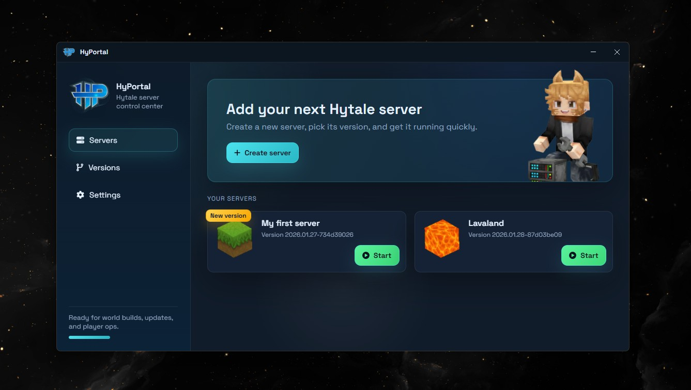

<div align="center">


# HyPortal

**A polished desktop command center for Hytale servers** — download versions, create instances, start/stop, and monitor logs on **Windows, macOS, and Linux**.

<!-- Optional badges (enable once you have them) -->
<!--
[](https://github.com/xavi-burgos99/hyportal/releases)
[](https://github.com/xavi-burgos99/hyportal/releases)
[](https://github.com/xavi-burgos99/hyportal/actions)
[](LICENSE)
-->
</div>

---

## Contents

- [Overview](#overview)
- [Key Features](#key-features)
- [Download](#download)
- [System Requirements](#system-requirements)
- [Install](#install)
- [Quick Start](#quick-start)
- [Project Structure](#project-structure)
- [Java Runtime Strategy](#java-runtime-strategy)
- [Build & Release](#build--release)
- [Contributing](#contributing)
- [Author & Contact](#author--contact)
- [License](#license)
- [Disclaimer](#disclaimer)

---

## Overview

HyPortal automates day-to-day Hytale server management in a single desktop app: version handling, one-click server creation, console/log access, and graceful start/stop workflows.

HyPortal integrates with the **official Hytale downloader** for version acquisition and performs a runtime check for **Java 25+** (depending on the build variant).



---

## Key Features

- **Cross-platform** desktop app: Windows, macOS (Intel/Apple Silicon), Linux
- **Version management**: download and manage server versions from one place
- **Server lifecycle**: create, start, stop, and monitor servers with clear status
- **Console & logs**: live output and diagnostics for faster troubleshooting
- **Runtime validation**: friendly prompts when dependencies are missing or outdated

---

## Download

Go to **GitHub Releases** and download the installer for your OS.

Each OS is published in two variants:

- **`with-jre`** — includes a bundled Java runtime (**ready to run**).
- **`no-jre`** — smaller download; requires **Java 25+** installed on the system.

> If you’re not sure which one to pick, choose **with-jre** for the most predictable setup.

---

## System Requirements

- **OS:** Windows 10/11, macOS, or a modern Linux distribution
- **Memory:** 4 GB RAM recommended
- **Storage:** enough space for downloaded versions + server instances
- **Java:** **Java 25+ required only for `no-jre` builds** (JRE is sufficient; a full JDK is not necessary)

---

## Install

### Windows
Run the **`.exe`** installer (NSIS) and follow the setup steps.

### macOS
Open the **`.dmg`**, then drag **HyPortal** into **Applications**.

### Linux
Use one of the provided formats depending on your distro:
- **`.AppImage`**
- **`.deb`**
- **`.rpm`**

If you install a **`no-jre`** build and Java 25+ is missing or outdated, HyPortal will block startup and guide you to install the correct runtime.

---

## Quick Start

1. Launch **HyPortal** (it will validate Java and the official downloader as needed).
2. Sign in with your Hytale account when prompted.
3. Download a server version and create a server instance.
4. Start/stop the server, inspect logs, and manage resources from the main panel.

---

## Project Structure

High-level layout:

- `electron/` — Electron **main** & **preload** processes
- `src/renderer/` — React UI (Vite)
- `resources/` — logos, installer assets, optional bundled JREs
- `scripts/` — tooling scripts (e.g. runtime fetchers)

---

## Java Runtime Strategy

HyPortal supports two distribution models:

### `with-jre`
- Bundles a compatible runtime (e.g. **Temurin Java 25 HotSpot**) for the target OS
- Best for end users and “it just works” deployments

### `no-jre`
- Uses the system-installed Java
- HyPortal enforces **Java 25+** via a runtime check and provides clear guidance when missing/outdated

### Fetching runtimes (for bundled builds)

```bash
# Fetch all platforms
npm run fetch:jre

# Fetch a single platform
node scripts/fetch-jre.mjs --platform win   # or: linux / mac
```

---

## Build & Release

### Commands

```bash
npm run dev               # Vite + Electron (watch mode)
npm run build:dist        # Build installers WITHOUT JRE
npm run build:dist:jre    # Build installers WITH JRE (run fetch:jre first)
npm start                 # Launch Electron against built assets
```

### Output layout

Build artifacts are organized under:

```
release/<version>/<os>/<no-jre|with-jre>/
```

### Notes for maintainers

* Building on the **target OS** is generally recommended for platform-specific packaging requirements (codesigning/notarization on macOS, distro integration on Linux, etc.).
* Keep release naming consistent across platforms to make the “with-jre vs no-jre” choice obvious.

---

## Contributing

* Use **Issues** for bugs, feature requests, and discussions.
* Submit PRs with **scoped, well-described changes**.
* Include screenshots for UI-related changes when relevant.

Links:

* Pull requests: [https://github.com/xavi-burgos99/hyportal/pulls](https://github.com/xavi-burgos99/hyportal/pulls)
* Issues: [https://github.com/xavi-burgos99/hyportal/issues](https://github.com/xavi-burgos99/hyportal/issues)

> By contributing, you agree that your work is distributed under the repository license terms.

---

## Author & Contact

Built by [@xavi-burgos99](https://github.com/xavi-burgos99) — independent, community-driven, **not affiliated with Hytale**. Support, feedback, and stars are always appreciated.

- LinkedIn: [https://www.linkedin.com/in/xavi-burgos/](https://www.linkedin.com/in/xavi-burgos/)
- GitHub: [https://github.com/xavi-burgos99](https://github.com/xavi-burgos99)
- X/Twitter: [https://x.com/xavi_burgos99](https://x.com/xavi_burgos99)
- Threads: [https://www.threads.com/@xavi_bf](https://www.threads.com/@xavi_bf)

---

## License

HyPortal is open source for **community, educational, and personal use**.

Commercial use (including selling binaries or closed/for-profit derivatives) is **not permitted**. Redistributions must keep attribution and this notice.

See **[LICENSE](LICENSE)** for the full terms.

---

## Disclaimer

HyPortal is an independent, community-focused tool and is **not an official Hytale product**. For legal inquiries or takedown requests, please contact via [LinkedIn](https://www.linkedin.com/in/xavi-burgos/), [GitHub](https://github.com/xavi-burgos99), [X/Twitter](https://x.com/xavi_burgos99), or [Threads](https://www.threads.com/@xavi_bf).

